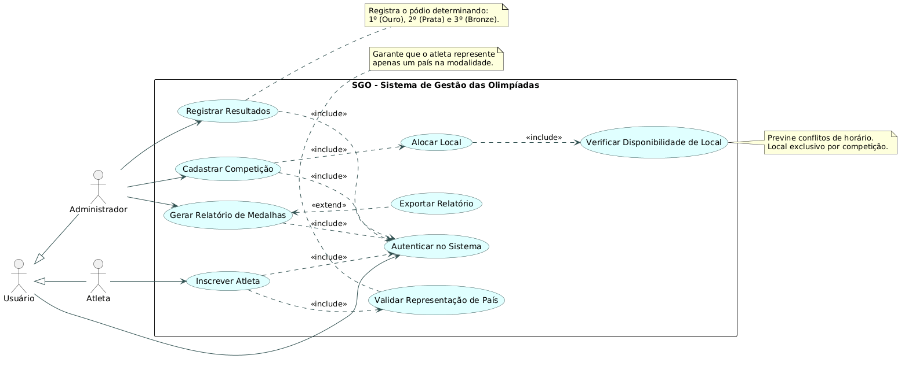
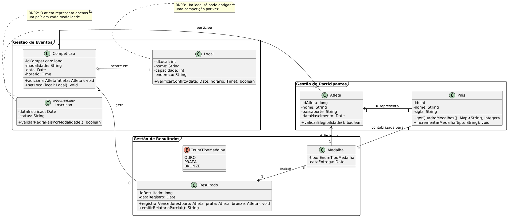
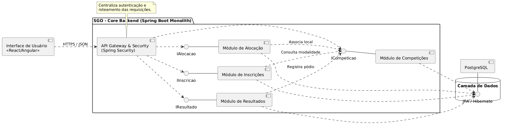
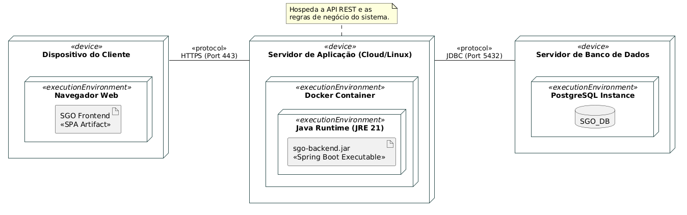

# Sistema de Gestão de Olimpíadas (SGO)
Sistema para gestão de competições esportivas para a disciplina de Projeto de Software. Este repositório contém toda a documentação necessária para este projeto.

# Detalhamento
O projeto do SGO visa atender aos usuários do sistema na organização de eventos esportivos de médio/grande porte. Para tal, decidi utilizar uma arquitetura mais enxuta, porém modular e escalável o suficiente para que o sistema seja de fácil manutenção e organização, sendo um monólito modular.

As tecnologias escolhidas para uma possível implementação posterior foram:
* Spring Boot java para back-end;
* React para front-end;
* PostgreSQL para persistência de dados.

## 🎯 Histórias de Usuário (User Stories)

As histórias abaixo foram extraídas das regras de negócio e da modelagem do sistema:

* **US01 - Cadastro de Competições:** Como administrador, eu quero cadastrar competições (informando modalidade, data, horário e local) para estruturar o calendário do evento olímpico. 
* **US02 - Inscrição de Atletas:** Como atleta, eu quero me inscrever em competições específicas, garantindo que eu represente um único país por modalidade, para manter a lisura do evento. 
* **US03 - Gestão de Conflitos de Local:** Como administrador, eu quero que o sistema bloqueie a alocação de um local se ele já estiver ocupado no mesmo horário, garantindo que um local abrigue apenas uma competição por vez.
* **US04 - Registro de Resultados:** Como administrador, eu quero registrar os resultados das competições, determinando o atleta vencedor e os classificados em segundo e terceiro lugares. 
* **US05 - Quadro de Medalhas:** Como usuário do sistema, eu quero visualizar um relatório de medalhas mostrando o desempenho de cada país com base nas medalhas de ouro, prata e bronze conquistadas.
* **US06 - Participação Múltipla:** Como atleta, eu quero poder participar de várias competições diferentes, desde que não infrinja a regra de representação única. 
* **US07 - Listagem de Inscritos:** Como administrador, eu quero poder visualizar a lista de atletas inscritos vinculada a cada competição cadastrada. 
* **US08 - Autenticação Restrita:** Como administrador, eu quero realizar o login no sistema com credenciais seguras, para garantir que apenas pessoas autorizadas alterem os dados do evento.
* **US09 - Consulta de Agenda:** Como usuário comum, eu quero consultar a lista de competições cadastradas por data e modalidade, para acompanhar a programação dos jogos. 
* **US10 - Exportação de Relatório:** Como administrador, eu quero exportar os relatórios gerados do quadro de medalhas, para facilitar a divulgação oficial na mídia.
* **US11 - Cadastro de Atletas:** Como administrador, eu quero cadastrar os dados básicos dos atletas (nome, passaporte) e o país de origem, para que eles estejam aptos a realizar as inscrições posteriormente.
* **US12 - Cadastro de Locais:** Como administrador, eu quero cadastrar a infraestrutura (locais e capacidade), para que os espaços estejam disponíveis no momento da alocação de provas. 
* **US13 - Validação de Elegibilidade:** Como sistema, eu devo verificar os dados do atleta no momento da inscrição para garantir que ele esteja vinculado corretamente a um país válido. 
* **US14 - Atualização de Pódio:** Como administrador, eu quero poder editar o registro de resultados após o fechamento da prova (ex: caso de doping), para garantir que as medalhas reflitam a realidade legal do evento. 

## 📐 Diagramas UML

Abaixo estão os diagramas modelados para a solução, desenvolvidos utilizando a ferramenta PlantUML. Os códigos fonte `.puml` encontram-se na pasta `/códigos` deste repositório.

### 1. Diagrama de Caso de Uso
Apresenta as interações principais dos atores (Atleta, Administrador e Usuário) com as funcionalidades do sistema.
 

### 2. Diagrama de Classes e Pacotes
Demonstra a estrutura de dados e as regras de negócio, divididas nos pacotes lógicos de Gestão de Eventos, Participantes e Resultados.
 

### 3. Diagrama de Componentes
Ilustra a arquitetura de software baseada no padrão Monolito Modular, destacando as interfaces disponibilizadas por cada módulo e o fluxo de dependência com a base de dados.
 

### 4. Diagrama de Implantação
Mapeia a topologia física da infraestrutura, demonstrando a execução do sistema via Spring Boot (`.jar`) em um contêiner e o banco de dados PostgreSQL.
 

