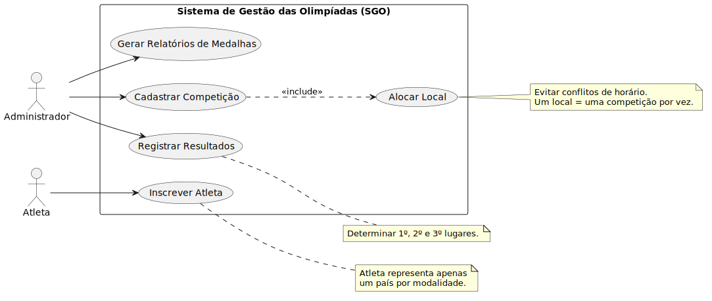
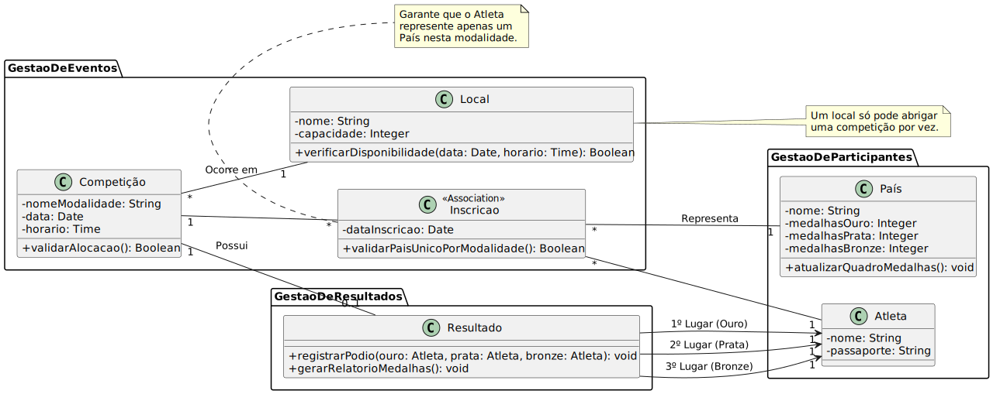
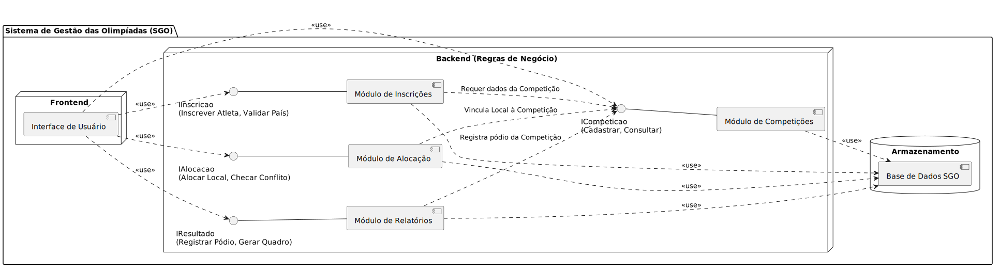
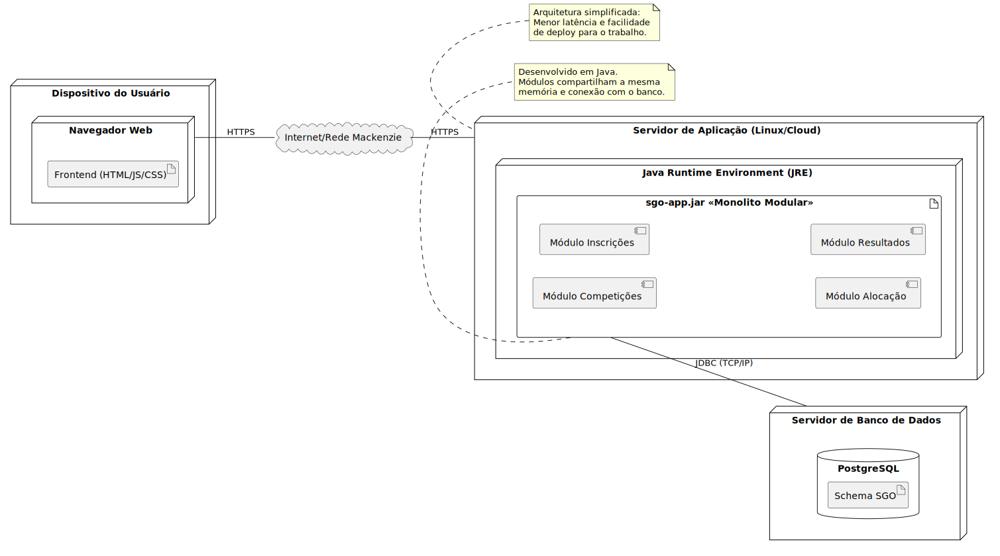

# Sistema-de-Gest-o-de-Olimpiadas
Sistema para gestão de competições esportivas para a disciplina de Projeto de Software. Este repositório contem toda a documentação necessária para este projeto.

## 🎯 Histórias de Usuário (User Stories)

As histórias abaixo foram extraídas das regras de negócio críticas do sistema:

* **US01 - Cadastro de Competições:** Como administrador, eu quero cadastrar competições (informando modalidade, data, horário e local) para estruturar o calendário do evento olímpico.
* **US02 - Inscrição de Atletas:** Como atleta, eu quero me inscrever em competições representando um único país por modalidade, para garantir a lisura e representatividade do evento.
* **US03 - Gestão de Conflitos de Local:** Como administrador, eu quero que o sistema bloqueie a alocação de um local se ele já estiver ocupado no mesmo horário, para evitar conflitos de infraestrutura.
* **US04 - Registro de Resultados:** Como administrador, eu quero registrar os resultados das competições definindo o 1º, 2º e 3º lugares, para alimentar o quadro de medalhas.
* **US05 - Quadro de Medalhas:** Como usuário do sistema, eu quero visualizar um relatório atualizado com as medalhas de ouro, prata e bronze por país, para acompanhar o desempenho das nações.

## 📐 Diagramas UML

Abaixo estão os diagramas modelados para a solução, desenvolvidos utilizando a ferramenta PlantUML. Os códigos fonte `.txt` encontram-se na pasta `/codigos` deste repositório.

### 1. Diagrama de Caso de Uso
Apresenta as interações principais dos atores (Atleta e Administrador) com as funcionalidades do sistema.
 

### 2. Diagrama de Classes e Pacotes
Demonstra a estrutura de dados e as regras de negócio, divididas nos pacotes lógicos de Gestão de Eventos, Participantes e Resultados.
 

### 3. Diagrama de Componentes
Ilustra a arquitetura de software, destacando as interfaces disponibilizadas por cada módulo e o fluxo de dependência até a base de dados.
 

### 4. Diagrama de Implantação
Mapeia a topologia física da rede, demonstrando a execução do sistema via Monolito Modular Java (`.jar`) e banco de dados relacional.
 

